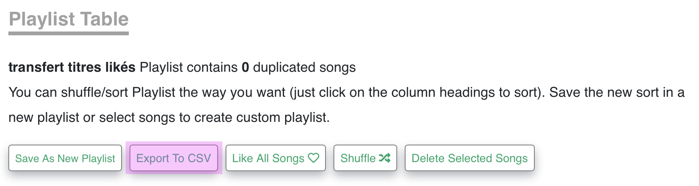
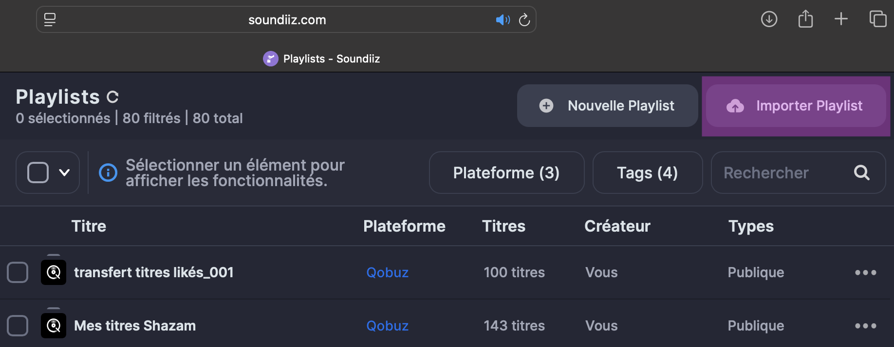
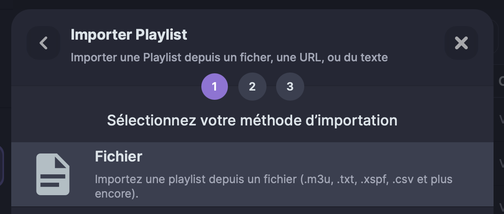

# pour tranférer des playlists entre plateformes de streaming

Avec un petit script qui fait des chunks de csv de 200 morceaux pour pas être obligé de souscrire à l'abo premium d'un service de transfer de playlists  ♪ ࿐ ₊ ˚ ⊹

[Soundiiz](https://soundiiz.com/) : pour transférer des playlists de la plateforme A vers la B
[Chosic](https://www.chosic.com/) : pour générer un .csv à partir du lien d'une playlist spotify

1. Sur [soundiiz](https://soundiiz.com/), rentrer ses identifiants des plateformes A et B
2. La version gratuite permet de transférer ses playlists 1 par 1
3. Et aussi, la version gratuite limite à 200 le nombre de morceaux transférer en 1 fois

Du coup si une playlist est trop longue, c'est possible de générer un fichier csv contenant tous ses morceaux dans l'ordre : 

4. sur la plateforme A, copier le lien de partage de la playlist

5. le coller dans la barre sur la page d'accueil de [chosic.com](https://www.chosic.com/) et télécharger le csv correspondant 


6. le script `split_csv.sh` permet de diviser le csv généré en chunks de 200 morceaux. Utilisation :
- mettre `split_csv.sh` dans les téléchargements, avec le csv
- ouvrir le terminal (sur mac : Cmd + Space -> "terminal")
- copier-coller ça :
    ```
    cd Downloads/
    chmod +x split_csv.sh
    ./split_csv.sh NOM_DU_FICHIER.csv
    ```
- le script crée un dossier chunks/ dans les téléchargements, avec tous les csv de 200 lignes

7. sur soundiiz, importer les csv 1 par 1 vers qobuz 

    
    


Voilà ( ˙꒳ ˙ )